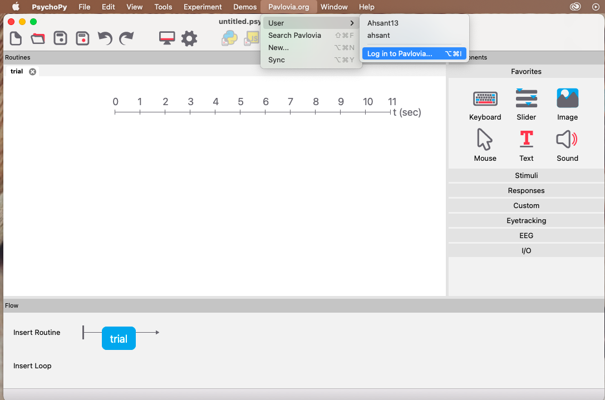

--- 
title: "Creating Online Experiments"
author: "Tasfia Ahsan"
date: "`r Sys.Date()`"
site: bookdown::bookdown_site
---
--- 
title: "Creating Online Experiments"
author: "Tasfia Ahsan"
date: "`r Sys.Date()`"
site: bookdown::bookdown_site
---

# Overview

When we carry out an in-person experiment we require three things: 

- recruiment website: place where we find participants (e.g URPP)
- hosting location: usually a computer in the lab
- consent form: paper consent form that is given to participants before they begin

For online experiment, the same three components are replaced by different websites that does each respective job

- recruitment website: URPP, prolific, mturk
- hosting website: pavlovia
- consent form: qualtrics or integrated into your experiment 

This book will go over the steps needed to create a smooth transition from recruiting participants online, redirecting them to sign the consent form and complete the experiment, and then bringing them back to the recruitment site to automatically provide compensation for their time.


<!--chapter:end:index.Rmd-->

# Initial Set up


## Setting up PsychoPy and Pavlovia

We will be building our experiment in PsychoPy and then running them online on Pavlovia. 

To begin, install [PsychoPy](https://www.psychopy.org) on your computer. Once you have PsychoPy set up on your computer, we will begin setting up for [Pavlovia](https://www.pavlovia.org). You can also access Pavlovia directly from PsychoPy interface:

```{r}
```


<!--chapter:end:02-Initial-Set-Up.Rmd-->

# Building an experiment with PsychoPy


<!--chapter:end:03-Building-an-Experiment-with-PsychoPy.Rmd-->

# Setting up consent form

<!--chapter:end:04-Setting-up-Consent-Form.Rmd-->

# Setting up recruitment website

<!--chapter:end:05-Setting-up-recruitment-website.Rmd-->

# Integrating everything online

<!--chapter:end:06-Integrating-everything-online.Rmd-->

